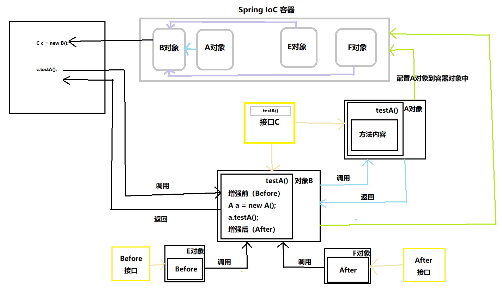

# AOP概述

## 什么是AOP？

AOP全称，Aspect Oriented Programming，面向切面编程。关于什么是面向切面编程后面可以细说。简单理解AOP就是在不影响原来代码的情况下，对原来的代码进行扩展增强。

## 为什么要使用AOP？

说到AOP自然可以想到OOP，面向对面编程。面向对面编程OOP解决了结构化编程难以抽象理解的问题。但是业务逻辑部门OOP的编程思想就难以解决了。这是利用AOP可以对业务逻辑的各个部分进行隔离，从而使得业务逻辑各部分之间的耦合度降低，提高程序的可重用性，同时提高了开发的效率。

## AOP的原理

通过动态代理和反射两个技术，利用现有的运行时对象，生成一个代理对象。这个代理对象包含了该运行时对象的方法，以及增强（Advice）。

如图所示可以简单的描述这个AOP的过程，可以很明显的看到A对象和E，F对象的业务逻辑部分相互隔离。提高了程序的重用性