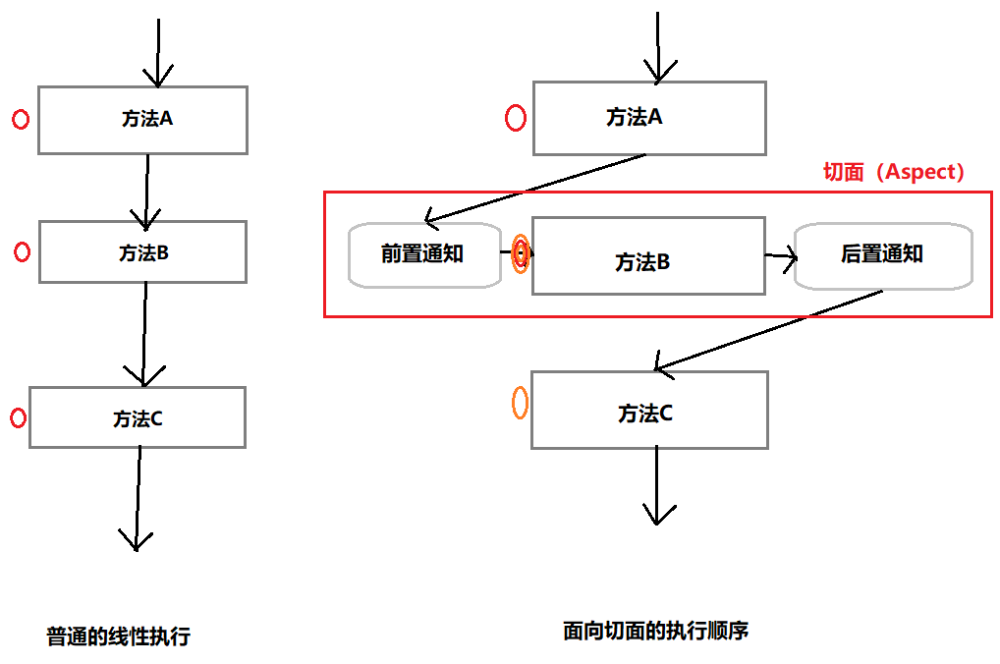

# 基于Schema配置的AOP

## 实现一个简单的Spring AOP程序

### 创建实体类

创建接口C

```java
package xyz.klenkiven.pojo;

public interface C {
    String testA(String str, int a);
}
```

创建实体类TestA，实现了接口C

```java
package xyz.klenkiven.pojo;

public class TestA implements C {
    @Override
    public String testA(String str, int a) {
        // int a = 5/0;    // ThrowAdvice对于异常的增强
        System.out.println("TestA:testA:"+ str +"是一个普通A对象, 参数a是" + a);
        return "对象成功生成了";
    }
}
```

### 创建 实现前置后置通知接口 的实体类

创建实体类MyAfter，实现AfterReturningAdvice接口

```java
package xyz.klenkiven.advice;

import org.springframework.aop.AfterReturningAdvice;

import java.lang.reflect.Method;

public class MyAfter implements AfterReturningAdvice {
    @Override
    public void afterReturning(Object returnValue, Method method, Object[] args, Object target) throws Throwable {
        System.out.println("MyAfter.afterReturning:我是后置通知" + returnValue);
    }
}
```

创建实体类MyBefore，实现MethodBeforeAdvice接口

```java
package xyz.klenkiven.advice;

import org.springframework.aop.MethodBeforeAdvice;

import java.lang.reflect.Method;

public class MyBefore implements MethodBeforeAdvice {

    @Override
    public void before(Method method, Object[] args, Object target) throws Throwable {
        System.out.println("MyBefore.before:我是前置通知" + method.getClass());
    }
}
```

### 配置bean和切面的相关信息

配置application-context.xml配置切面的相关信息

```xml
<?xml version="1.0" encoding="UTF-8"?>
<beans xmlns="http://www.springframework.org/schema/beans"
       xmlns:xsi="http://www.w3.org/2001/XMLSchema-instance"
       xmlns:aop="http://www.springframework.org/schema/aop"
       xsi:schemaLocation="http://www.springframework.org/schema/beans http://www.springframework.org/schema/beans/spring-beans.xsd
        http://www.springframework.org/schema/aop
        http://www.springframework.org/schema/aop/spring-aop.xsd">
    <!-- 配置对象Bean -->
    <bean id="a" class="xyz.klenkiven.pojo.TestA" />
    <!-- 配置前后通知对象 -->
    <bean id="before" class="xyz.klenkiven.advice.MyBefore" />
    <bean id="after" class="xyz.klenkiven.advice.MyAfter" />
    <!-- 配置AOP -->
    <aop:config>
        <aop:pointcut id="pointcut" expression="execution(* xyz.klenkiven.pojo.TestA.testA(String, int))"/>
        <aop:advisor advice-ref="before" pointcut-ref="pointcut" />
        <aop:advisor advice-ref="after" pointcut-ref="pointcut" />
    </aop:config>
</beans>
```

### 创建Test类

```java
package xyz.klenkiven.test;

import org.springframework.context.ApplicationContext;
import org.springframework.context.support.ClassPathXmlApplicationContext;
import xyz.klenkiven.pojo.C;

public class SpringAOPTest {
    public static void main(String[] args) {
        ApplicationContext ac = new ClassPathXmlApplicationContext("application-context.xml");
        C c = (C) ac.getBean("a");
        c.testA("张三", 12);
    }
}
```

运行以后的结果为：

```
MyBefore.before:我是前置通知class java.lang.reflect.Method
TestA:testA:张三是一个普通A对象, 参数a是12
MyAfter.afterReturning:我是后置通知对象成功生成了
```

### 前置通知（BeforeAdvice）和后置通知（AfterAdvice）

Join Point：在执行项目程序的时候中的一个点，例如方法的执行或者异常的处理。

Pointcut：匹配Join point的谓词。大白话说就是一个匹配Join Point语句。

> pointcut 的作用就是提供一组规则(使用 AspectJ pointcut expression language 来描述) 来匹配joinpoint, 给满足规则的 joinpoint 添加 Advice.）

那么配置里面的pointcut就是用来匹配切入点的，也就是Join Point。


知道了上面的概念以后就好理解**前置通知**和**后置通知**了。



如图所示，方法ABC本来是正常顺序执行的。找到切点（方法B）以后重新进行作用，最后形成的这个和顺序执行并不相同，那么这个就是切面。这个切面整体，将会使用AOP Proxy使用的是CGLIB的技术把它动态代理到接口中，这个过程叫做织入（weaving）。织入这个过程，不仅仅可以发生在载入时，运行时，在编译的时间里也可以织入。如果你想要使用B方法，直接`InterfaceC c = applicationContext.getBean("target")` 获得对象C以后，直接就可以调用方法B`c.methodB()` 与正常使用并没有什么区别。但是执行的时候，你需要意识到，这个方法B已经不是原来的方法B了，而是增强以后的fangfaB，此时获得的对象C也不是包含原始方法B的对象target，而是target的代理对象Proxy。

> 所有有红圈的地方就是 Join Point。通过Pointcut找到对应的切入点也就是橙色的圈，这里也许就更好去理解切入点了。

### 前置后置通知参数解释

```java
public void before(Method method, Object[] args, Object target) throws Throwable;
```

+ method  —— 被调用的方法本身
+ args —— 被调用的方法的参数列表
+ target —— 调用方法的对象，该对象包含此方法，可以为空

```java
public void afterReturning(Object returnValue, Method method, Object[] args, Object target) throws Throwable;
```

+ returnValue —— 调用方法的返回值
+ method —— 被调用的方法本身
+ args —— 被调用的方法的参数列表
+ target —— 调用方法的对象，该对象包含此方法，可以为空

## 环绕通知（RoundAdvice）

### 创建 实现MethodInterceptor接口 的实体类

```java
package xyz.klenkiven.advice;

import org.aopalliance.intercept.MethodInterceptor;
import org.aopalliance.intercept.MethodInvocation;

public class MyRound implements MethodInterceptor {
    @Override
    public Object invoke(MethodInvocation invocation) throws Throwable {
        // 扩展前的代码
        System.out.println("环绕通知  --  前");
        // 原有代码
        Object proceed = invocation.proceed();
        // 扩展后代码
        System.out.println("环绕通知  --  后:" + proceed);

        return proceed;
    }
}
```

### 配置bean和切面的相关信息

```xml
<!-- 环绕通知Bean -->
    <bean id="round" class="xyz.klenkiven.advice.MyRound" />

<!-- 在AOP配置里面添加 -->
        <aop:advisor advice-ref="round" pointcut-ref="pointcut" />
```

### 运行结果

```
环绕通知  --  前
TestA:testA:张三是一个普通A对象, 参数a是12
环绕通知  --  后:对象成功生成了
```

### 环绕参数解释

```java
public Object invoke(MethodInvocation invocation) throws Throwable;
```

+ invocation —— 方法调用切入点

  > 虽然哈看着这个参数很少，但是麻雀虽小五脏俱全：
  >
  > + getMethod() —— 获得被调用的方法Method对象
  > + getArguments() —— 获得调用对象的实参
  > + proceed() —— Proceed to the next interceptor in the chain.
  > + 等等。。。

## 异常通知

### 创建 实现ThrowsAdvice接口 的实体类

```java
package xyz.klenkiven.advice;

import org.springframework.aop.ThrowsAdvice;

public class MyThrow implements ThrowsAdvice {
    public void afterThrowing(Exception e) {
        System.out.println("我是异常通知Bean" + e.getMessage());
    }
}
```

### 配置bean和切面的相关信息

```xml
<!-- 异常通知Bean -->
    <bean id="throw" class="xyz.klenkiven.advice.MyThrow" />
<!-- 在AOP配置里面添加 -->
        <aop:advisor advice-ref="throw" pointcut-ref="pointcut" />
```

### 运行结果

+ 出现异常

```
MyBefore.before:我是前置通知class java.lang.reflect.Method
环绕通知  --  前
我是异常通知Bean/ by zero
Exception in thread "main" java.lang.ArithmeticException: / by zero
```

+ 一切正常

```
MyBefore.before:我是前置通知class java.lang.reflect.Method
环绕通知  --  前
TestA:testA:张三是一个普通A对象, 参数a是12
环绕通知  --  后:对象成功生成了
MyAfter.afterReturning:我是后置通知对象成功生成了
```

> 所以这个东西就很明显了，是在方法调用抛出异常的时候才会出现的通知。

### 参数解释

> 这个接口很特殊，没有任何的实现方法，但是！官方文档提到了需要自己去实现一些方法
>
> Tag interface for throws advice.
> There are not any methods on this interface, as methods are invoked by reflection. Implementing classes must implement methods of the form:
> `void afterThrowing([Method, args, target], ThrowableSubclass);`
>
> Some examples of valid methods would be:
> `public void afterThrowing(Exception ex)`
> `public void afterThrowing(RemoteException)`
> `public void afterThrowing(Method method, Object[] args, Object target, Exception ex)`
> `public void afterThrowing(Method method, Object[] args, Object target, ServletException ex)`
> The first three arguments are optional, and only useful if we want further information about the joinpoint, as in AspectJ **after-throwing** advice.
>
> **Note**: If a throws-advice method throws an exception itself, it will override the original exception (i.e. change the exception thrown to the user). The overriding exception will typically be a RuntimeException; this is compatible with any method signature. However, if a throws-advice method throws a checked exception, it will have to match the declared exceptions of the target method and is hence to some degree coupled to specific target method signatures. **Do not throw an undeclared checked exception that is incompatible with the target method's signature!**

遇到这样的情况确实是很奇怪啊，没见过。我想到下面几个问题：

+ 为什么不全都写出来？

  答案很简单，如果把方法全写出来，实现这个接口的实体类必须把这些方法全都实现一遍，这很不合理也不合适，产生了很多的冗余。

+ 为什么不使用抽象方法？

  emmmm，这个。。。原谅是因为我简单的认为，抽象方法不必全部实现。但是！**父类中所有的抽象方法必须在子类中实现！**否则子类就是一个抽象类了，还是会产生冗余问题。因此这种做法是合理的。

## Spring AOP的声明格式

1. 切点是某包某类的无参数方法：

   ```
   execution(* xyz.klenkiven.pojo.Student.testStudent())
   ```

2. 切点是某包某类的有参数方法：

   ```
   execution(* xyz.klenkiven.pojo.Student.testStudent(String, int))
   ```

3. 切点是某包某类某个同名的所有方法：

   > `..` 表示任意个数任意类型的参数 

   ```
   execution(* xyz.klenkiven.pojo.Student.testStudent(..))
   ```

4. 切点是某包下的某类的所有方法：

   > `*` 表示任意的类名，方法名，包名

   ```
   execution(* xyz.klenkiven.pojo.Student.*(..))
   ```

5. 切点是某包下的所有类的方法：

   ```
   execution(* xyz.klenkiven.pojo.*.*(..))
   ```

   