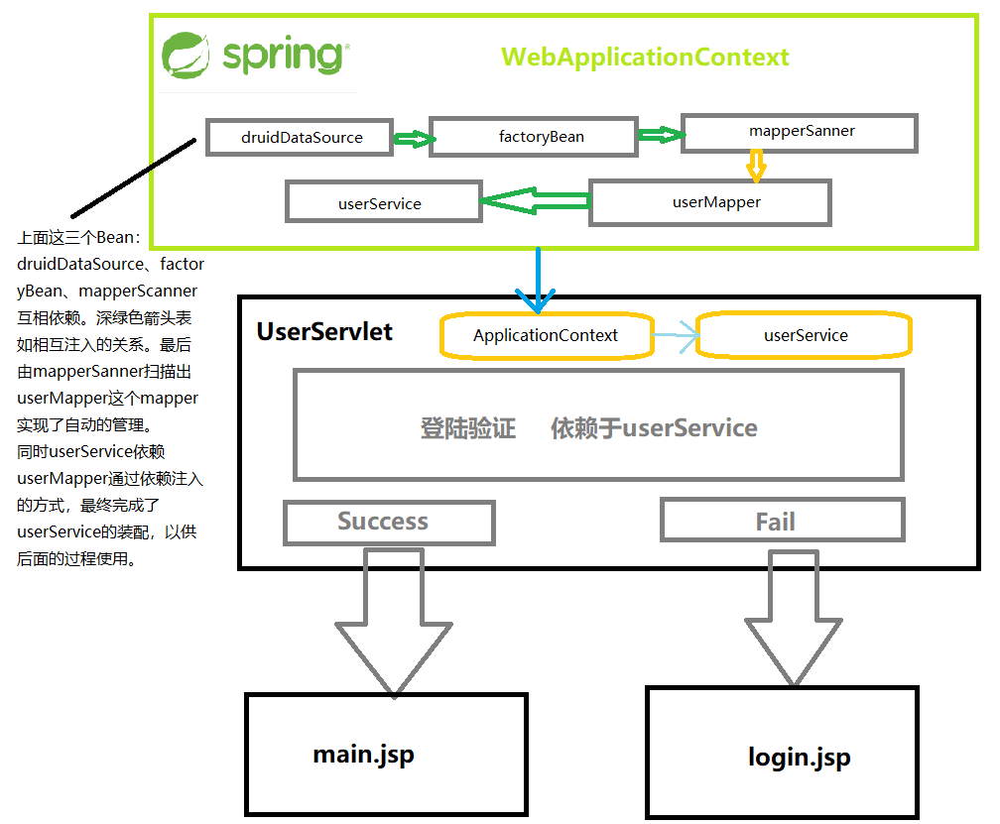

# Spring 和 MyBatis 两大框架的整合

>  实验室的第一个预约系统使用的是MyBatis框架解决了和数据库交互的相关操作，但是这样确实看起来挺。。。。复古的。因为我对于技术的选择比较激进，喜欢更加新的技术。后来尝试使用Spring和Mybatis整合，前前后后加上在学校的时间差不多花费了1-2个月了。因为参考的是Ruoyi的项目，不知不觉又到了SpringBoot的那边。很显然SpringBoot，我并没有学习过。
>
> 后来在B站上面找到了一系列关于Spring质量不错的视频，里面讲解了关于Spring的很多东西，真的是看书真的太头疼了，还是视频来的快，差不多2-3天（摸鱼）的情况下就整合了Spring和Mybatis。在下面的笔记记录一下过程。
>
> 
>
> 阅读者所需的前置知识：
>
> + JavaWEB至少得学会吧
>
> + Spring IOC的学习
> + maven得知道怎么用
> + 知道如何用mybatis去连接数据库
> + ~~JSP（其实我都不会，照着视频抄下来的）~~ 

## 搭建项目配置POM

创建项目什么的很简单很常规就不在赘述。

### 配置项目的依赖

+ Spring核心组件的相关依赖

  ```xml
  <!-- Spring Core Dependencies -->
          <dependency>
              <groupId>org.springframework</groupId>
              <artifactId>spring-aop</artifactId>
              <version>${springframework.version}</version>
          </dependency>
          <dependency>
              <groupId>org.springframework</groupId>
              <artifactId>spring-beans</artifactId>
              <version>${springframework.version}</version>
          </dependency>
          <dependency>
              <groupId>org.springframework</groupId>
              <artifactId>spring-context</artifactId>
              <version>${springframework.version}</version>
          </dependency>
          <dependency>
              <groupId>org.springframework</groupId>
              <artifactId>spring-expression</artifactId>
              <version>${springframework.version}</version>
          </dependency>
          <dependency>
              <groupId>commons-logging</groupId>
              <artifactId>commons-logging</artifactId>
              <version>1.2</version>
          </dependency>
  ```

+ Spring WEB的一些组件

  > 其实这个并没有必要加入，视频里面讲到了一些这些东西。看书的时候，视频里面讲的配置。在Spring MVC里面也出现过，因此这里注意一下还是很有帮助理解后面的知识的。

  ```xml
  <!-- Spring WEB -->
          <dependency>
              <groupId>org.springframework</groupId>
              <artifactId>spring-web</artifactId>
              <version>${springframework.version}</version>
          </dependency>
  ```

+ 数据库驱动以及Mybits的相关依赖（包括mybatis-spring等等）

  > 因为我用的是MariaDB所以用的是MariaDB的驱动
  >
  > **注意！如果使用的是其他的驱动，在配置文件里面涉及到驱动的配置一定要注意替换**
  >
  > mybatis的整合依赖里面包括：spring-jdbc，spring-tx不必惊讶

  ```xml
  <!-- 数据库驱动Mybatis及其Spring整合包 -->
  		<!-- 下面这个依赖是MariaDB的驱动，需要其他的驱动就替换掉 -->
          <dependency>
              <groupId>org.mariadb.jdbc</groupId>
              <artifactId>mariadb-java-client</artifactId>
              <version>2.6.2</version>
          </dependency>
          <dependency>
              <groupId>org.mybatis</groupId>
              <artifactId>mybatis</artifactId>
              <version>3.5.5</version>
          </dependency>
          <dependency>
              <groupId>org.mybatis</groupId>
              <artifactId>mybatis-spring</artifactId>
              <version>2.0.6</version>
          </dependency>
          <dependency>
              <groupId>org.springframework</groupId>
              <artifactId>spring-tx</artifactId>
              <version>${springframework.version}</version>
          </dependency>
          <dependency>
              <groupId>org.springframework</groupId>
              <artifactId>spring-jdbc</artifactId>
              <version>${springframework.version}</version>
          </dependency>
  ```

+ 日志相关的依赖配置

  ```xml
  <!-- log4j && slf4j 日志相关依赖 -->
          <dependency>
              <groupId>org.apache.logging.log4j</groupId>
              <artifactId>log4j</artifactId>
              <version>${log4j.version}</version>
              <type>pom</type>
          </dependency>
          <dependency>
              <groupId>org.apache.logging.log4j</groupId>
              <artifactId>log4j-api</artifactId>
              <version>${log4j.version}</version>
          </dependency>
          <dependency>
              <groupId>org.apache.logging.log4j</groupId>
              <artifactId>log4j-core</artifactId>
              <version>${log4j.version}</version>
          </dependency>
          <dependency>
              <groupId>org.slf4j</groupId>
              <artifactId>slf4j-api</artifactId>
              <version>${slf4j.version}</version>
          </dependency>
          <dependency>
              <groupId>org.slf4j</groupId>
              <artifactId>slf4j-log4j12</artifactId>
              <version>${slf4j.version}</version>
          </dependency>
  ```

+ 阿里数据库连接池Druid

  > 因为在Spring配置的时候，MyBatis是需要数据库连接池的，Mybatis其实有自带的，但是嘛，主流用的就是Druid咯，我也没办法咯。

  ```xml
  <!--阿里数据库连接池 -->
          <dependency>
              <groupId>com.alibaba</groupId>
              <artifactId>druid</artifactId>
              <version>${druid.version}</version>
          </dependency>
  ```

### 配置项目的版本信息

> 在上面的项目里面有很多这种类似于`${slf4j.version}`，`${springframework.version}` 这样的东西，其实这些都是在properties标签里面配置的。

```xml
<properties>
    <maven.compiler.target>1.8</maven.compiler.target>
    <maven.compiler.source>1.8</maven.compiler.source>
    <junit.version>5.7.0</junit.version>
    <!-- Spring 框架版本信息 -->
    <springframework.version>5.3.1</springframework.version>
    <!-- druid 数据连接池版本 -->
    <druid.version>1.2.2</druid.version>
    <!-- log4j日志包版本 -->
    <slf4j.version>1.7.30</slf4j.version>
    <log4j.version>2.14.0</log4j.version>
</properties>
```

### 配置项目的构建工具

+ 这个一般创建项目的时候自带的，这个是打包war包的工具

  ```xml
  <build>
      <plugins>
          <plugin>
              <groupId>org.apache.maven.plugins</groupId>
              <artifactId>maven-war-plugin</artifactId>
              <version>3.3.0</version>
          </plugin>
      </plugins>
  </build>
  ```

+ 打包方法的配置应该像下面这样配置

  ```xml
  <groupId>xya.klenkiven</groupId>
  <artifactId>SpringAndMybatisIntegration</artifactId>
  <version>1.0</version>
  <name>SpringAndMybatisIntegration</name>
  <packaging>war</packaging>
  ```

**想看全部的代码还得是看项目源码咯**

## 创建数据库

+ 创建数据库smintegration，编码方式设置成`utf8mb4_general_ci` 可以避免乱码。

+ 创建表格，并填充数据

  ```sql
  -- 创建新的表
  DROP TABLE if EXISTS `t_user`;
  CREATE TABLE `t_user` (
  	`uid` INT(11) NOT NULL AUTO_INCREMENT,
  	`uname` VARCHAR(100) NOT NULL COLLATE 'utf8mb4_general_ci',
  	`pwd` VARCHAR(100) NOT NULL COLLATE 'utf8mb4_general_ci',
  	PRIMARY KEY (`uid`) USING BTREE
  );
  COLLATE='utf8mb4_general_ci';
  ENGINE=INNODB;
  
  -- 添加数据库数据
  INSERT INTO t_user VALUES (DEFAULT, '张三', '123'); 
  INSERT INTO t_user VALUES (DEFAULT, '李四', '456');
  ```

## 配置ApplicationContext的配置文件

> 这里主要是想要配置Mybatis的相关解决办法。因为Mybatis获取SqlSession的时候使用的是SqlSessionFactory。这很显然是一个工厂模式啊！Spring可以帮我们托管这种事情，因此这里作为一个思路的切入点去配置Mybatis。
>
> 这些先不说首先怎么去配置MyBatis呢？

### 原始配置MyBatis的方法

```xml
<?xml version="1.0" encoding="UTF-8" ?>
<!DOCTYPE configuration
        PUBLIC "-//mybatis.org//DTD Config 3.0//EN"
        "http://mybatis.org/dtd/mybatis-3-config.dtd">
<configuration>
    <!-- 配置别名 -->
    <typeAliases>
        <package name="xyz.klenkiven.pojo"/>
    </typeAliases>
    <!-- 配置数据源 -->
    <environments default="mariadb">
        <environment id="mariadb">
            <transactionManager type="JDBC" />
            <dataSource type="POOLED">
                <property name="driver" value="org.mariadb.jdbc.Driver"/>
                <property name="username" value="root"/>
                <property name="password" value="root"/>
                <property name="url" value="jdbc:mariadb://localhost:3306/smintegration"/>
            </dataSource>
        </environment>
    </environments>
    <!-- 配置mapper扫描 -->
    <mappers>
        <package name="xyz.klenkiven.mapper"/>
    </mappers>
</configuration>
```

+ 原始配置方式主要就是下面三个方面：
  1. 数据源的配置
  2. 配置别名
  3. 配置mappers的扫描

### applicationcontext.xml配置

+ Spring的ApplicationContext的配置框架结构

  ```xml
  <?xml version="1.0" encoding="UTF-8"?>
  <beans xmlns="http://www.springframework.org/schema/beans"
         xmlns:xsi="http://www.w3.org/2001/XMLSchema-instance"
         xsi:schemaLocation="http://www.springframework.org/schema/beans http://www.springframework.org/schema/beans/spring-beans.xsd">
  </beans>
  ```

+ 数据源的配置

  ```xml
  <!-- 创建数据源 -->
      <bean id="druidDataSource" class="com.alibaba.druid.pool.DruidDataSource" >
          <property name="driverClassName" value="org.mariadb.jdbc.Driver" />
          <property name="url" value="jdbc:mariadb://localhost:3306/smintegration" />
          <property name="username" value="root" />
          <property name="password" value="root" />
      </bean>
  ```

  上面使用的是Druid这个数据连接池去获取数据源，其实和mybatis里面的数据源配置大同小异。

+ 配置别名 && 配置SqlSessionFactory的Bean

  > 这里其实不仅仅是配置了别名这个问题，跟重要的是，配置好了SqlSessionFactory的Bean。那么可以通过这个Bean获取到其他的东西了，比如获取Mapper的实例化对象。

  ```xml
  <!-- 创建SqlSessionFactory的Bean -->
      <bean id="factoryBean" class="org.mybatis.spring.SqlSessionFactoryBean" >
          <property name="dataSource" ref="druidDataSource" />
          <property name="typeAliasesPackage" value="xyz.klenkiven.pojo" />
      </bean>
  ```

+ 配置mapper的扫描器

  ```xml
  <!-- 扫描mapper路径 -->
      <bean id="mapperScaner" class="org.mybatis.spring.mapper.MapperScannerConfigurer" >
          <property name="sqlSessionFactoryBeanName" value="factoryBean"/>
          <property name="basePackage" value="xyz.klenkiven.mapper" />
      </bean>
  ```

到这里，关于数据库和Mybatis的配置基本上就完善了，其他的就是在一个标准的目录结构中进行代码的编写。

## 编写User的POJO类

> 这个POJO类就是只含有私有属性，还有get set方法的类。在MyBatis官方一般称为Domain类

```java
package xyz.klenkiven.pojo;

public class User {
    private Integer uid;
    private String uname;
    private String pwd;

    public User() {
    }

    public User(Integer uid, String uname, String pwd) {
        this.uid = uid;
        this.uname = uname;
        this.pwd = pwd;
    }

    public Integer getUid() {
        return uid;
    }

    public void setUid(Integer uid) {
        this.uid = uid;
    }

    public String getUname() {
        return uname;
    }

    public void setUname(String uname) {
        this.uname = uname;
    }

    public String getPwd() {
        return pwd;
    }

    public void setPwd(String pwd) {
        this.pwd = pwd;
    }
}
```

## 编写数据库的映射的操作（写Mapper接口）

这个接口类的位置，对应的是mapper扫描器的属性 `basePackage` 对应的位置 `xyz.klenkiven.mapper`

```java
package xyz.klenkiven.mapper;

import org.apache.ibatis.annotations.Param;
import org.apache.ibatis.annotations.Select;
import xyz.klenkiven.pojo.User;

public interface UserMapper {

    // 用户登录
    @Select("select * from t_user where uname=#{uname} and pwd=#{pwd}")
    User userLoginMapper(@Param("uname") String uname, @Param("pwd") String pwd);

}
```

## 编写服务类

一般而言，服务类都是接口定义这个Service类，可以提供什么服务（方法）。

+ UserService

  ```java
  package xyz.klenkiven.service;
  
  import xyz.klenkiven.pojo.User;
  
  import java.io.IOException;
  
  public interface UserService {
      // 用户登录
      User userLoginService(String uname, String pwd) throws IOException;
  }
  ```

+ UserServiceImpl（上面服务类的实现类）

  ```java
  package xyz.klenkiven.service.impl;
  
  import xyz.klenkiven.mapper.UserMapper;
  import xyz.klenkiven.pojo.User;
  import xyz.klenkiven.service.UserService;
  
  import java.io.IOException;
  
  public class UserServiceImpl implements UserService {
  
      // ！！！注意这里！！！
      UserMapper userMapper;
  
      // 用户登录
      @Override
      public User userLoginService(String uname, String pwd) throws IOException {
          // 完成数据库查询
          User user = userMapper.userLoginMapper(uname, pwd);
          return user;
      }
  
      public UserMapper getUserMapper() {
          return userMapper;
      }
  
      public void setUserMapper(UserMapper userMapper) {
          this.userMapper = userMapper;
      }
  }
  ```

  > 上面的代码，里面的属性是userMapper但是却没有实例化的对象。这里其实可以在applicationcontext.xml里面配置相关的信息，通过依赖注入的方式获得一个单例的userService可以极大的解决，代码耦合的问题。这里三言两语也说不太清楚，可以看看视频试试。

  + 在applicationcontext.xml增加Bean，通过依赖注入的方式

    ```xml
    <!-- 配置业务层Bean -->
        <bean id="userService" class="xyz.klenkiven.service.impl.UserServiceImpl">
            <property name="userMapper" ref="userMapper"/>
        </bean>
    ```


## 编写WEB相关的代码

UserServlet代码如下：

```java
package xyz.klenkiven.controller;

import org.springframework.context.ApplicationContext;
import org.springframework.web.context.support.WebApplicationContextUtils;
import xyz.klenkiven.pojo.User;
import xyz.klenkiven.service.UserService;

import javax.servlet.ServletException;
import javax.servlet.annotation.WebServlet;
import javax.servlet.http.HttpServlet;
import javax.servlet.http.HttpServletRequest;
import javax.servlet.http.HttpServletResponse;
import javax.servlet.http.HttpSession;
import java.io.IOException;

@WebServlet(value = "/userLogin", loadOnStartup = 1)
public class UserServlet extends HttpServlet {

    /*
     * 这里涉及到一个很有意思的东西，就是Servlet的生命周期。
     * Servlet一般是在第一次访问的时候加载，但是可以通过修改
     * 参数例如上面的 loadOnStartup = 1 使得在Servlet容器
     * 启动的时候就加载这个Servlet。
     * 还有一点值得注意的是，Servlet是以单例的形态存在于容器中的
     * 意思就是这个Servlet只生成一次，但是service方法会执行
     * 很多次。
     * 因此，为了性能就可以优化一些东西，比如在获取对象的时候，尽
     * 量不要在service方法体中创建对象，在高并发的情况下，这种操作
     * 会让服务器内存不堪重负。
     */
    UserService userService;

    @Override
    public void init() throws ServletException {
        // 在初始化的时候就生成userService了
        // 下面这句话将会被用另一种方式优化掉，但是思想我觉得很有意思，值得学习
        // ApplicationContext ac = new ClassPathXmlApplicationContext("applicationContext.xml");
        ApplicationContext ac = WebApplicationContextUtils.getWebApplicationContext(this.getServletContext());
        userService = (UserService) ac.getBean("userService");
    }

    @Override
    public void service(HttpServletRequest req, HttpServletResponse resp) throws ServletException, IOException {
        // 设置请求编码格式
        req.setCharacterEncoding("utf-8");
        // 设置响应编码格式
        resp.setCharacterEncoding("utf-8");
        resp.setContentType("text/html;charset=utf-8");

        // 获取请求信息
        String name = req.getParameter("uname");
        String password = req.getParameter("pwd");

        // 处理请求
        // 调用业务层方法
        User user = userService.userLoginService(name, password);
        // 响应结果
        HttpSession session = req.getSession();
        if (user != null){
            session.setAttribute("user", user);
            resp.sendRedirect(req.getContextPath() + "/main.jsp");  // Success
        }
        else{
            session.setAttribute("flag", "loginFail");
            resp.sendRedirect(req.getContextPath() + "/login.jsp"); // Fail
        }
    }
}
```

> 上面的注释说明了Servlet的生命周期，以及初始化执行 的东西。

web.xml

```xml
<?xml version="1.0" encoding="UTF-8"?>
<web-app xmlns="http://xmlns.jcp.org/xml/ns/javaee"
         xmlns:xsi="http://www.w3.org/2001/XMLSchema-instance"
         xsi:schemaLocation="http://xmlns.jcp.org/xml/ns/javaee http://xmlns.jcp.org/xml/ns/javaee/web-app_4_0.xsd"
         version="4.0">
    <!-- 配置全局参数：记录Spring的配置文件名 -->
    <context-param>
        <param-name>contextConfigLocation</param-name>
        <param-value>classpath:applicationcontext.xml</param-value>
    </context-param>

    <!-- 配置Spring的监听器 -->
    <!-- spring-web Dependency is needed -->
    <listener>
        <listener-class>org.springframework.web.context.ContextLoaderListener</listener-class>
    </listener>
</web-app>
```

> 通过这个监听器，`ApplicationContext ac = WebApplicationContextUtils.getWebApplicationContext(this.getServletContext());` 就可以通过这句话获得 `contextConfigLocation` 了，从而直接加载出一个ApplicationContext。
>
> 值得注意的是，这是一个静态的方法获得的，因此有理由相信这个监听类ContextLoaderLinstener，监听到服务器容器启动以后，就会启动Spring的IoC容器，并且创建一个单例的WebApplicationContext。这样就可以使得，这个ApplicationContext的生命周期会很长，直到服务器关闭。这个我觉得可以单独写一下了。

### 下面的jsp什么的就没意思了，就不赘述了，直接看代码哇

login.jsp

```jsp
<%--
  Created by IntelliJ IDEA.
  User: klenkiven
  Date: 2021/1/18
  Time: 17:09
  To change this template use File | Settings | File Templates.
--%>
<%@ page contentType="text/html;charset=UTF-8" language="java" %>
<%@taglib prefix="c" uri="http://java.sun.com/jsp/jstl/core" %>
<html>
<head>
    <title>Spring Mybatis整合</title>
</head>
<body>
<h3>欢迎使用SM整合</h3>
<hr/>
<c:if test="${sessionScope.flag == 'loginFail'}">
    <p style="color: red; font-size: 20px">用户名或者密码错误！</p>
</c:if>
<form action="userLogin" method="post">
    用户名：<input type="text" name="uname" value="" /><br/>
    密码：<input type="password" name="pwd" value="" /><br/>
    <input type="submit" value="登录" />
</form>
</body>
</html>
```

main.jsp

```jsp
<%--
  Created by IntelliJ IDEA.
  User: klenkiven
  Date: 2021/1/18
  Time: 17:42
  To change this template use File | Settings | File Templates.
--%>
<%@ page contentType="text/html;charset=UTF-8" language="java" %>
<html>
<head>
    <title>登录成功</title>
</head>
<body>
    <h1>${sessionScope.user.uname}登陆成功！我是主页面</h1>
</body>
</html>
```

> 到这里项目就基本搭建好了，上面有几个地方值得去记录一下，有很值得探讨的东西。

## 项目的结构



上面这个深蓝色的箭头，是通过ServletContext里面获得WebApplicationContext的。很显然这是在服务器启动的时候，这个ApplicationContext就已经启动了。具体怎么生成的，这个可以通过查看监听器ContextLoaderLinstener的相关相关代码查看。

这个浅蓝色的箭头就是直接从WebApplicationContext里面获得Bean实例对象。

上面的factoryBean的生成，还有mapperScanner这个Bean的生成也大有讲究，这个又可以深入探究，挖坑就完了。

上面的整个过程都在运行时（Runtime）完成的。

